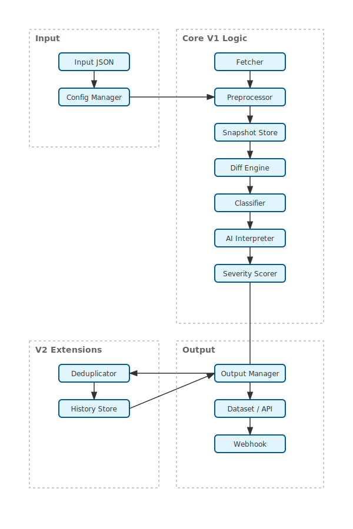

#  SWIM: Semantic Web Intelligent Monitor

**Precision-focused, production-ready actor for monitoring semantic changes on web pages.**

This actor goes beyond simple HTML diffing. It uses structured analysis, noise reduction, and optional AI interpretation to detect *meaningful* changes (pricing, policies, product availability) while ignoring the noise (ads, timestamps, random IDs).

---

## 🌟 Features

### V1: The Core (MVP)
- **Structured Diffing**: Ignores script modifications, style changes, and structural noise.
- **Multi-Element Support**: Monitors product lists, grids, or multiple specific elements via CSS selectors.
- **Smart Presets**: Pre-configured logic for Pricing, Policy, and Competitor monitoring.
- **Severity Scoring**: Assigns a 0-100 impact score to every change.
- **AI Interpretation**: (Optional) Uses LLMs (OpenAI) to explain *why* the change matters.
- **Production Ready**: Robust error handling, MD5 URL hashing for safe storage, and structured logging.
- **Apify Integration**: Native support for Dataset, KV Store (Hashed keys), and real Webhook Delivery.

### V2: Extended Intelligence
- **Deduplication Engine**: Prevents alert fatigue by hashing `(Diff + Severity + URL)`.
- **Change History**: Tracks historical trends (e.g., price history over time).
- **Explainability**: detailed `reasons` array in the output.

---

## 🚀 Usage

### Input Configuration

The actor accepts a strict JSON input schema:

```json
{
    "targetUrl": "https://example.com/pricing",
    "preset": "pricing_monitor",
    "useAi": true,
    "aiOptions": {
        "provider": "openai",
        "apiKey": "sk-...",
        "model": "gpt-4-turbo"
    },
    "notificationConfig": {
        "webhookUrl": "https://hooks.zapier.com/..."
    }
}
```

### Presets

| Preset | Target Elements | Keywords | Use Case |
| :--- | :--- | :--- | :--- |
| `pricing_monitor` | `.price`, `.amount`, `.offer` | price, cost, discount | E-commerce, SaaS pricing |
| `policy_monitor` | `main`, `.legal`, `.terms` | liability, privacy, terms | Legal compliance, TOS updates |
| `competitor_monitor` | `h1`, `h2`, `.features` | launch, new, beta | Competitive intelligence |
| `generic_monitor` | `body` (noise reduced) | - | General purpose monitoring |

---

## 📦 Output

The actor pushes results to the default Apify Dataset.

### Example Output (V1 + V2)

```json
{
    "url": "https://example.com/pricing",
    "timestamp": "2023-10-27T10:00:00Z",
    "changeDetected": true,
    "severityScore": 85,
    "changeType": "content_modified",
    "diffSummary": {
        "text": "Price changed from $10 to $12",
        "structured": [
            {
                "path": "div.price[0]",
                "selector": "#pricing > div.card:nth-child(1) > span.amount",
                "old": "$10",
                "new": "$12",
                "type": "modified"
            }
        ]
    },
    "aiAnalysis": {
        "summary": "The monthly subscription price increased by 20%.",
        "reasoning": "Likely inflation adjustment or tier restructuring."
    },
    "v2": {
        "isDuplicate": false,
        "deduplicationHash": "a1b2c3d4...",
        "historyDepth": 5,
        "reasons": ["Price increase", "High severity score"]
    }
}
```

---

## 🛠️ Installation & Development

### Prerequisites
- Node.js 16+
- Apify CLI (`npm install -g apify-cli`)

### Setup
1. Clone the repository.
2. Install dependencies:
    ```bash
    npm install
    ```
3. Run locally:
    ```bash
    apify run
    ```

### Testing
To verify logic without live requests, use the mock tests:
```bash
npm test
```

---

## 💰 Resource Requirements

**Memory:**
- Minimum: 512 MB
- Recommended: 1024 MB (for AI mode)
- With large pages (>5MB HTML): 2048 MB

**Runtime:**
- Simple page: 5-10 seconds
- Average page: 10-20 seconds
- Complex page with AI: 20-30 seconds

**Cost Estimate:**
- Without AI: ~$0.01 per 100 runs
- With AI (GPT-4): ~$0.05 per run (OpenAI API cost additional)

**Recommended Schedule:**
- Price monitoring: Every 6-12 hours
- Policy monitoring: Daily
- Competitor analysis: Every 24 hours

---

## 🏗️ Architecture

- **Fetcher**: HTTP-based (Cheerio) for speed and determinism.
- **Diff Engine**: Structure-aware comparison algorithm.
- **Snapshot Store**: Apify Key-Value store for persistence.
- **Extensions**: Deduplicator & History Manager (V2).


